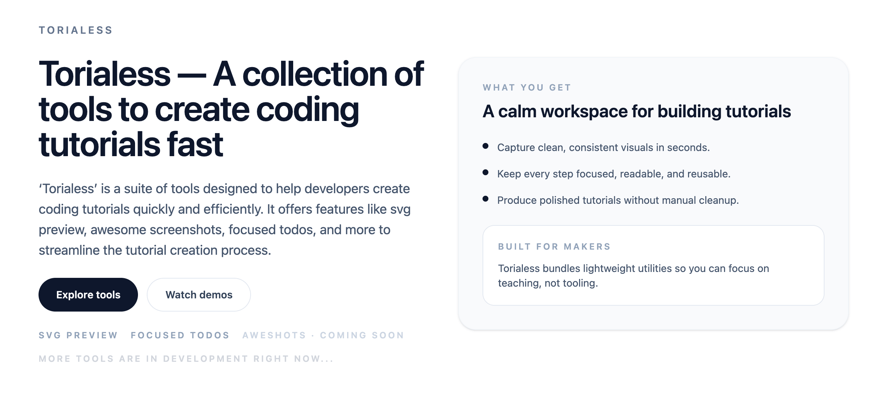

# Torialess

Torialess is a curated, open-source hub of focused tools for content creators. The goal is to provide fast, friendly, and practical utilities that help creators get work done without distractions. More tools are in active development, and we welcome new ideas to make this the best go-to toolkit for creators.

## ✨ Available Tools

- **Focused Todos**: A minimal, distraction-free task list to keep creators on track.
- **SVG Preview**: Quickly preview and inspect SVG assets.

More tools are in development right now. If you want to add a tool or have an idea, feel free to open a PR.

## 🤝 Contributing

We love contributions of all sizes. Whether it’s a new tool, a bug fix, improved documentation, or UX polish, your help is appreciated.

### How to Contribute

1. Fork the repo and create your branch from `main`.
2. Install dependencies with `npm install`.
3. Start the dev server with `npm run dev`.
4. Make your changes, keeping the UI accessible and the code clean.
5. Open a PR with a clear description and screenshots for UI changes.

### Contribution Guidelines

- Keep changes focused and small where possible.
- Follow the existing code style and component patterns.
- Use semantic HTML and accessible UI patterns.
- Include any relevant tests or manual testing notes.
- Avoid breaking changes unless discussed in the PR.

### Proposing New Tools

If you have an idea for a new tool:

- Open an issue describing the problem it solves and the intended UX.
- Include any mockups or examples if available.
- If you want to implement it, open a draft PR to discuss early.

## 🧰 Local Development

All commands are run from the root of the project:

| Command                   | Action                                           |
| :------------------------ | :----------------------------------------------- |
| `npm install`             | Installs dependencies                            |
| `npm run dev`             | Starts local dev server at `localhost:4321`      |
| `npm run build`           | Build your production site to `./dist/`          |
| `npm run preview`         | Preview your build locally, before deploying     |
| `npm run astro ...`       | Run CLI commands like `astro add`, `astro check` |
| `npm run astro -- --help` | Get help using the Astro CLI                     |

## 📄 License

[MIT](LICENSE)
